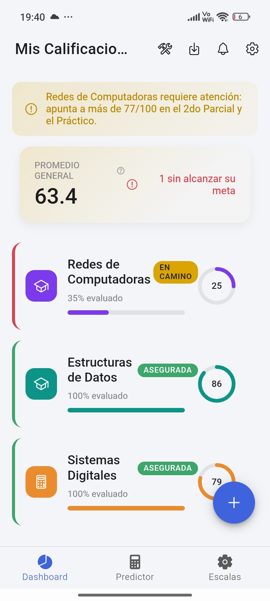
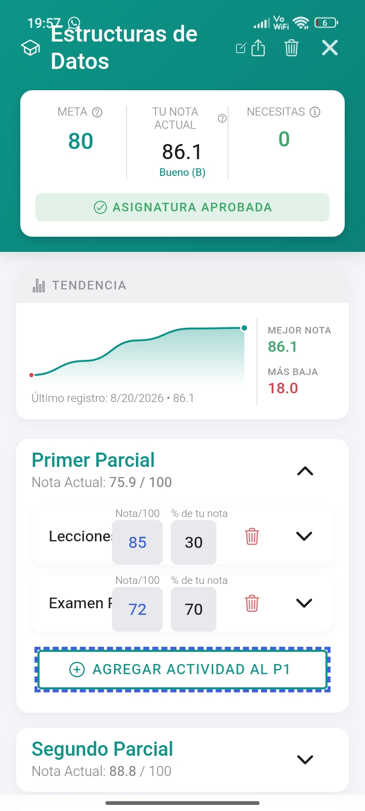
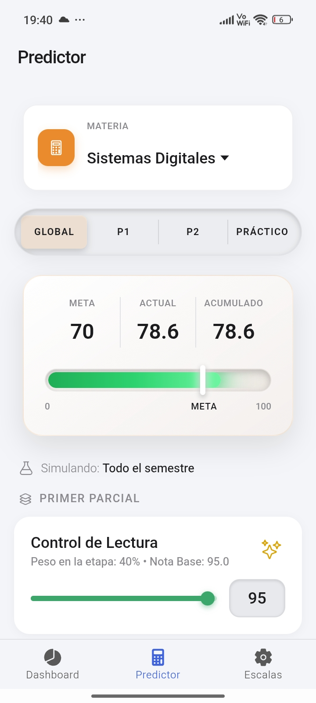
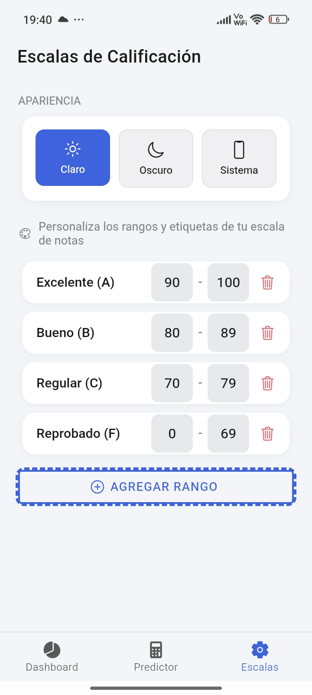

# 🎓 Mis Calificaciones - Academic Tracker

> Un gestor académico elegante, predictivo y *mobile-first* construido con React e Ionic Framework. 

**Mis Calificaciones** no es solo una libreta de notas digital. Es una herramienta inteligente diseñada para dar paz mental a los estudiantes universitarios. Permite llevar un control exacto del semestre, visualizar el progreso en tiempo real y, a través de su algoritmo predictivo, calcular matemáticamente la calificación exacta que se necesita en futuras evaluaciones para alcanzar una meta académica.

  
  
  
   

---

## ✨ Características Principales

### 📊 Dashboard Interactivo y Minimalista
*   **Visión Global:** Cálculo automático del Promedio General ponderado de todo el semestre.
*   **Tarjetas de Materias:** Interfaz basada en *Glassmorphism* (efecto cristal) que muestra el progreso porcentual del semestre, la nota acumulada y un gráfico *Sparkline* de tendencia histórica.
*   **Badges Emocionales:** Etiquetas dinámicas automáticas que evalúan el estado de la materia (*Asegurada*, *En Camino*, *En Riesgo*, *Perdida*).

### 🪄 Predictor Inteligente ("What-If")
*   **Segmentación por Parciales:** Simula notas en modo Global, Primer Parcial (P1), Segundo Parcial (P2) o Práctico.
*   **Varita Mágica (Auto-Fill):** Un botón inteligente que calcula y rellena automáticamente la calificación mínima necesaria en una actividad específica para que ese parcial alcance la meta fijada.
*   **Two-Way Data Binding:** Sliders (`IonRange`) conectados en tiempo real a inputs manuales. Al mover uno, el otro se actualiza y el Termómetro Global reacciona al instante.

### ⚙️ Personalización y Escalas
*   **Sistema de Escalas Custom:** Permite definir letras (A, B, C, F) y rangos numéricos personalizados para que la app se adapte al sistema de calificación de cualquier universidad.
*   **Dark Mode / Light Mode:** Integración perfecta con el tema del sistema operativo.

### 📱 Experiencia Nativa (Capacitor)
*   **Almacenamiento Local:** Los datos se guardan en el dispositivo del usuario utilizando `Capacitor Preferences` para una experiencia *Offline-First*.
*   **Haptic Feedback:** Vibraciones sutiles en interacciones clave (como alcanzar la meta o eliminar una materia) para una UX premium.
*   **Notificaciones Locales:** Recordatorios semanales configurables para actualizar las notas.
*   **Exportar Resumen:** Uso de la API nativa de `Share` para enviar el reporte de notas por WhatsApp o correo.

---

## 🛠️ Stack Tecnológico

*   **Frontend:** [React](https://reactjs.org/) (Hooks, Context API)
*   **UI Framework:** [Ionic Framework v7](https://ionicframework.com/) (Componentes UI, animaciones fluidas, arquitectura móvil)
*   **Lenguaje:** [TypeScript](https://www.typescriptlang.org/) (Tipado estático y seguridad)
*   **Integración Nativa:** [Capacitor](https://capacitorjs.com/) (Haptics, Share, Local Notifications, Preferences)
*   **Animaciones extras:** Canvas Confetti (Celebración al alcanzar la meta)

---

## ✒️ Autores

Desarrollado por **Josué Pacheco** y **Pablo Chacon**. 

> Proyecto creado para facilitar la gestión de calificaciones a los estudiantes universitarios.